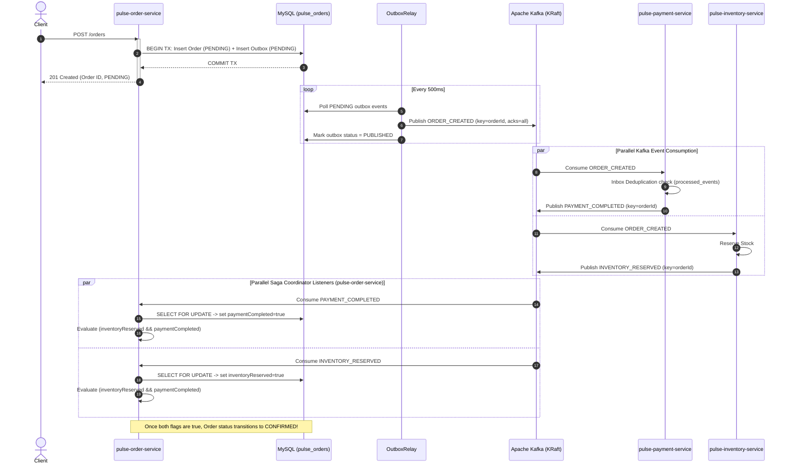
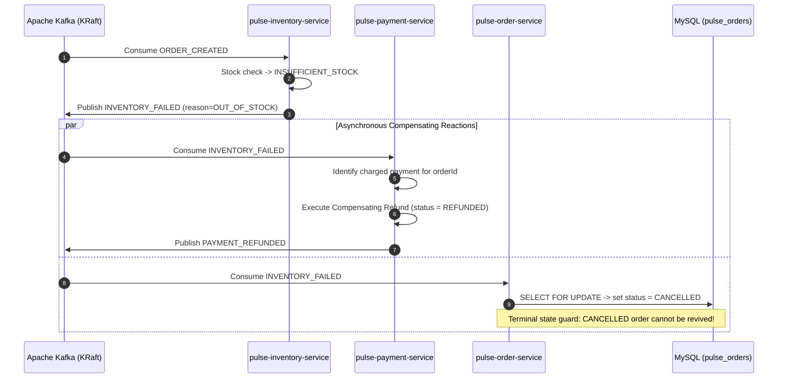

# PulseStream: Distributed Event-Driven Microservices Platform

[](https://openjdk.org/)
[](https://spring.io/projects/spring-boot)
[](https://kafka.apache.org/)
[](https://www.mysql.com/)
[](https://testcontainers.com/)
[]()

> **PulseStream** is a production-grade, distributed event-driven microservices platform engineered in **Java 21**, **Spring Boot 3.4.3**, **Apache Kafka (KRaft mode)**, and **MySQL 8**. It implements hardened distributed systems patterns to eliminate the dual-write problem, guarantee idempotent event processing, isolate poison pills via non-blocking Dead-Letter Queues (DLQ), and coordinate multi-service business workflows through choreographed sagas with automated compensating transactions.

---

## 1. Architectural Highlights & Distributed Patterns

| Distributed Pattern | Problem Solved | PulseStream Implementation |
| :--- | :--- | :--- |
| **Transactional Outbox Pattern** | Dual-write vulnerability between database transactions and message broker publishes. | Persists `OrderEntity` and `OutboxEventEntity` in a single local ACID transaction. An asynchronous `OutboxRelay` polls pending outbox records and publishes to Kafka with `acks=all`. |
| **Distributed Idempotent Consumer** | Kafka *at-least-once* delivery causes duplicate events during rebalances or network retries. | Implements the **Inbox Pattern** via a dedicated `processed_events` table inside transactional boundaries, guaranteeing zero duplicate debits or reservations. |
| **Non-Blocking Retry & DLQ** | Poison pills and transient consumer failures stall consumer group partition progress. | Uses Spring Kafka `@RetryableTopic` with multi-tier exponential backoff (`order-events-retry-1000`, `order-events-retry-2000`). Unrecoverable failures route directly to `.DLT` queues without halting the main partition. |
| **Choreographed Distributed Saga** | Lack of distributed ACID transactions across isolated per-service databases. | Services react asynchronously to domain events (`OrderCreated`, `PaymentCompleted`, `InventoryReserved`). If stock is depleted, an `InventoryFailed` event triggers compensating refunds in Payment Service and order cancellation in Order Service. |
| **Pessimistic Row-Locking Concurrency** | Parallel consumer threads for concurrent saga events overwriting aggregate state (Lost Update Anomaly). | Uses MySQL row-level pessimistic locking (`SELECT ... FOR UPDATE` via `@Lock(LockModeType.PESSIMISTIC_WRITE)`) in `OrderRepository` to serialize asynchronous state updates and guarantee clean terminal transition to `CONFIRMED`. |
| **Partition-Key In-Order Guarantees** | Concurrent events for the same order arriving out-of-order at downstream consumers. | All order-related events are keyed by `orderId`, guaranteeing strict FIFO log sequencing within the exact same Kafka partition. |

---

## 2. System Architecture & Service Topography

```text
                                  [ HTTP Client ]
                                         |
                                         v (POST /orders)
                              +---------------------+
                              | pulse-order-service | (Port 8081)
                              | DB: pulse_orders    |
                              +----------+----------+
                                         | (Transactional Outbox)
                                         v
                         =============================
                                KAFKA EVENT LOG
                         =============================
                                 ^           ^
                                 |           |
                                 v           v
                      +------------------+   +---------------------+
                      |pulse-payment-svc |   | pulse-inventory-svc |
                      |  (Port 8082)     |   |    (Port 8083)      |
                      | DB: pulse_payment|   | DB: pulse_inventory |
                      +------------------+   +---------------------+
```

---

## 3. Choreographed Distributed Saga Lifecycle

### 3.1 Happy Path: Dual Event Convergence to `CONFIRMED`



### 3.2 Compensating Rollback Path: Out of Stock Failure



---

## 4. Multi-Module Project Structure

```text
pulsestream/
├── pom.xml                     # Multi-module Maven parent POM (Java 21, Spring Boot 3.4.3)
├── docker-compose.yml          # Kafka 4.2.2 KRaft, Kafka UI, MySQL 8
├── pulse-common-events/        # Shared immutable Java 21 event records & EventEnvelope<T>
├── pulse-order-service/        # Order ingress, Transactional Outbox & Saga Coordinator (8081)
├── pulse-payment-service/      # Idempotent payment processing & compensating refunds (8082)
└── pulse-inventory-service/    # Stock reservation & Non-blocking Retry/DLQ pipelines (8083)
```

---

## 5. Technology Stack

- **Runtime & Language**: Java 21 LTS
- **Framework**: Spring Boot 3.4.3, Spring Kafka, Spring Data JPA
- **Event Streaming**: Apache Kafka 4.2.2 (KRaft mode — zero ZooKeeper dependency)
- **Databases**: MySQL 8.0 (Database-per-service pattern: 3 isolated schemas)
- **Database Migrations**: Flyway 10
- **Testing & Verification**: JUnit 5, Mockito, Testcontainers 1.20.4, Awaitility 4.2.2
- **Container Infrastructure**: Docker Compose, Kafka UI (Port 8085)

---

## 6. Automated Test Suite Matrix (Testcontainers)

Every distributed systems guarantee in PulseStream is validated via automated integration tests running against real Docker containers:

| Service | Test Class | Validated Guarantee |
| :--- | :--- | :--- |
| `pulse-order-service` | `OrderOutboxRelayIntegrationTest` | Atomic Outbox persistence + asynchronous polling relay with `acks=all`. |
| `pulse-order-service` | `OrderSagaIntegrationTest` | Dual-event convergence to `CONFIRMED` via pessimistic locking; `INVENTORY_FAILED` cancellation; `PAYMENT_FAILED` cancellation. |
| `pulse-order-service` | `OrderIntegrationTest` | REST API `POST /orders` creates order and outbox record in single transaction. |
| `pulse-payment-service` | `PaymentConsumerIntegrationTest` | Idempotent inbox deduplication (replaying duplicate `ORDER_CREATED` events) + compensating refund on `INVENTORY_FAILED`. |
| `pulse-inventory-service` | `InventoryConsumerIntegrationTest` | Multi-tier retry topic routing with exponential backoff + poison pill `.DLT` isolation. |

To run the complete integration test suite across all modules:
```bash
mvn clean test
```

---

## 7. Local Infrastructure Setup

To run PulseStream's local infrastructure (Kafka KRaft cluster, MySQL, Kafka UI):

```bash
# 1. Start Docker infrastructure
docker compose up -d

# 2. Access Kafka UI
# Open http://localhost:8085 in your browser to monitor topics, consumer lag, and partitions.
```